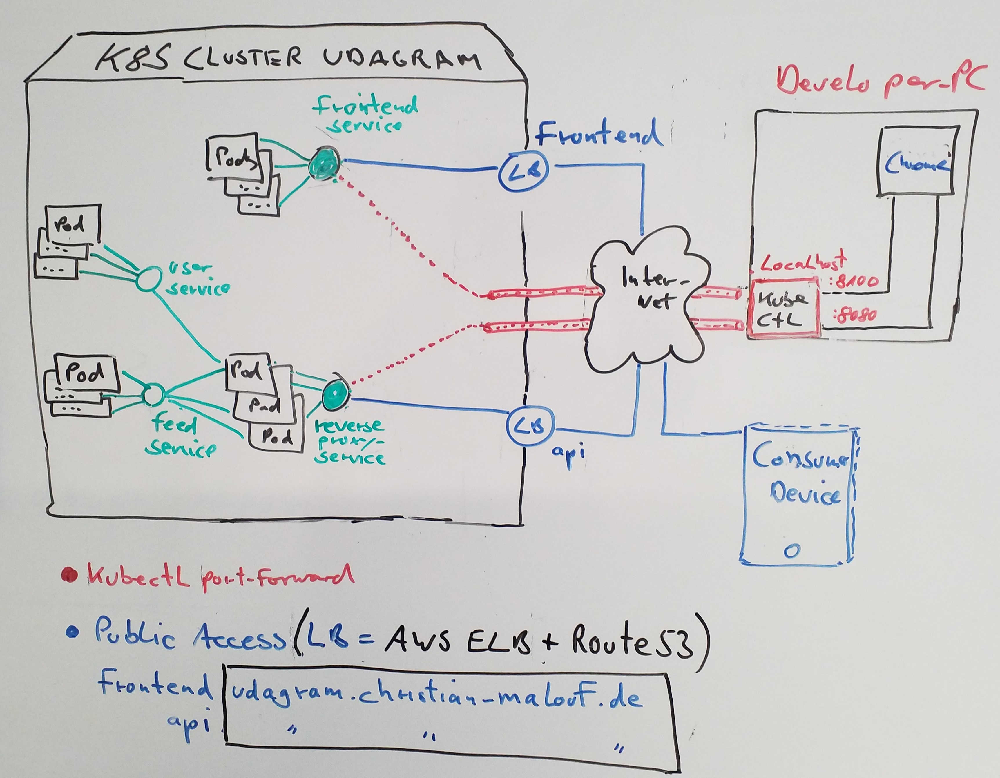

# UDAGRAM MICROSERVICES COURSE [](https://travis-ci.org/maloufde/udagram-microservices-course)

## Introduction
This Repository contains the code for **Project 4** of the [Udacity Cloud-Developer Nanodegree](https://www.udacity.com/course/cloud-developer-nanodegree--nd9990) 
on **Monolith to Microservices** decomposition. It implements a simple Instagram-like App to enable the user to register, login and upload images.

The **Frontend** is currently publicly accessible at:
* http://frontend.udagram.christian-malouf.de (**Master**-Branch)
* http://dev-frontend.udagram.christian-malouf.de (**Development**-Branch)

The Rest-Api (e.g. feed) is deployed to:
* http://api.udagram.christian-malouf.de/api/v0/feed (**Master**-Branch)

## Overview of a Kubernetes deployment

This is an Overview of the app as it is deployed to a Kubernetes cluster on AWS EC2 instances.



The app is assembled of 3 domain specific parts:
* an **SPA-frontend** based on IONIC,
* a backend **feed microservice** that will store and retrieve the images on an *AWS S3 bucket*,
* a backend **user microservice** for registering and logging into the app.

An additional **reverse-proxy** will route api-requests to the appropriate microservice, based on the URL.

Last but not least there is a **deployment** part with information and config files to launch the app 
on _Docker_ and _Kubernetes_.
 
In order to review or try out this project easily, it includes all these components as subfolders, 
knowing that this would not be the preferred structure for team development on microservices. 
Please have a look to the appropriate subdirectory for further details on each part.

## Basic Requirements
As outlined in the course you'll need to setup different components:
* **AWS S3 bucket**, _aka 'AWS media bucket'_.
* **AWS credentials** for an **IAM user** with sufficient rights to access the media bucket 
* **PostgreSQL** database, accessible from your environment 
* **Docker** installation
* **Docker-Compose** installation (>= v1.23.2)

## Prepare environment 
With basic requirements fulfilled, you should have `~/.aws/credentials`in place and 
be able to configure the following environment variables: 
* **UDCD_AWS_CREDENTIALS** The path to the AWS credentials, e.g. /users/bill/.aws or c:/users/bill/.aws **(1)**
* **UDCD_AWS_PROFILE**: The AWS profile to take credentials from, e.g. default
* **UDCD_AWS_REGION**: The AWS region, e.g. us-east-1
* **UDCD_AWS_MEDIA_BUCKET**: The AWS S3 bucket where the images are stored
* **UDCD_CORS_ALLOW**: The origin to be allowed to access the backend services from Javascript
* **UDCD_JWT_SECRET**: The secret for JWT authentication
* **UDCD_POSTGRES_HOST**: The public domain name of the PostgreSQL Database instance
* **UDCD_POSTGRES_DATABASE**: The name of the PostgreSQL Database
* **UDCD_POSTGRES_PASSWORD**: The password of the PostgreSQL Database
* **UDCD_POSTGRES_USERNAME**: The name of the PostgreSQL User

**Notes:**
1. On Docker Desktop for Windows, the bind mounted directory must be enabled as _Shared Drive_ in Docker Settings.

## Build and Run all images with docker-compose
Change the API-URL in udacity-c3-frontend\src\environment.ts from  
  `apiHost: 'http://api.udagram.christian-malouf.de/api/v0/'` to `apiHost: 'http://localhost:8080/api/v0/'`

```
# build
cd udacity-c3-deployment/docker
docker-compose build

# run    
docker-compose up -d    
```

Check status with `docker-compose ps`, tail logs with `docker-compose log -f`.

Open the frontend in your Browser: http://localhost:8100

## Deployment on Kubernetes Cluster
Kubernetes resources are configured in subdirectory `udacity-c3-deployment/kubernetes`. 
See scripts `setup-kubectl.sh` and `update-kubernetes-namespace.sh` for details. These scripts are used on Travis-CI 
to populate the app into one namespace per branch. You can select the Travis-CI _passed_-Image to see the previous build.

## Collecting Logfiles in CloudWatch
Container Logfiles are forwarded to AWS CloudWatch, see [README-CloudWatch](README-CloudWatch.md) for 
further details. 
